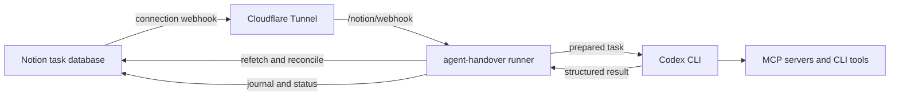

# agent-handover

`agent-handover` is an alpha-stage local service for running explicitly queued
Notion tasks through Codex CLI. It is intended for a trusted operator who wants
a shared task queue and audit journal while keeping execution policy, secrets,
and durable launch state on one private host.

The repository contains the Rust CLI, private host configuration foundation,
and build and release tooling. The commands validate and expose their execution
configuration, but do not contact Notion or launch Codex yet. Follow the
[roadmap](#roadmap) for the remaining implementation sequence.

## Intended capabilities

- Discover tasks whose `Executor` is `Codex` and `Status` is `Pending`.
- Use [Notion connection webhooks][notion-webhooks] for prompt discovery and
  reconciliation for reliability.
- Run one task at a time through [Codex's non-interactive interface][codex-exec]
  and the host's existing MCP servers and CLI tools.
- Record every attempt in a shared Notion journal and project task progress as
  `Pending -> Running -> Done | Error`.
- Recover interrupted bookkeeping without automatically launching Codex again.

Codex is the only planned executor for the first release. The internal executor
boundary will remain provider-neutral, but a Claude adapter, multiple host
profiles, concurrent execution, and automatic agent retries are out of scope.

## Architecture



Cloudflare Tunnel only exposes the local webhook endpoint. Tunnel provisioning,
DNS, access controls, and service management belong to the operator, not this
project.

## Quick start

Build and exercise the CLI from the locked development environment:

```sh
nix develop --command cargo run
nix develop --command cargo test
```

The operator flow is to configure and share the Notion data sources, enroll a
connection webhook, expose only that route through Cloudflare Tunnel, and start
`agent-handover serve`. At present the runner commands validate configuration
and report that it is ready; integrations will become active as later roadmap
tickets land.

## Notion setup

The target runner works with Notion Free through the Public API and connection
webhooks. It does not depend on [paid database automations][notion-automations]
or the paid `Send webhook` automation action. A connection webhook is a change
notification: the runner always refetches current Notion state before deciding
whether a task is eligible.

Create an internal Notion connection, grant only the capabilities needed to
read task content and update task and journal properties, and share both data
sources with that connection.

The task data source must provide:

| Field | Contract |
| --- | --- |
| Title | Existing task title |
| Page body | The complete instruction source for Codex |
| `Executor` | Select value; initially `Codex` |
| `Status` | Status values `Pending`, `Running`, `Error`, and `Done` |

The shared journal must provide one entry per attempt with:

- an immutable run ID and relation to the task;
- executor and start/end times;
- outcome, summary, actions, and warnings.

Keep data source IDs and property mappings in private host configuration. Do
not put them in this repository.

### Connection webhook

The planned `webhook-enroll` command captures Notion's one-time verification
token with overwrite protection. Subsequent webhook requests are authenticated
from the exact raw body using the `X-Notion-Signature` HMAC. Events are only
signals: they can be delayed, duplicated, or delivered out of order, as
described by [Notion's event-delivery contract][notion-delivery], so the runner
refetches the page and reconciliation remains authoritative for discovery.

Notion requires a public HTTPS webhook URL. A [locally managed Cloudflare
Tunnel][cloudflare-tunnel] can route only the webhook path to the loopback-bound
runner; use placeholders, not real host values, when adapting this example:

```yaml
tunnel: <TUNNEL_UUID>
credentials-file: /path/to/<TUNNEL_UUID>.json

ingress:
  - hostname: handover.example.com
    path: /notion/webhook
    service: http://127.0.0.1:<PORT>
  - service: http_status:404
```

The final catch-all rule is required by `cloudflared`. Provision and protect the
tunnel separately, then configure the resulting HTTPS URL in the Notion
connection's webhook subscription.

## Private host configuration

The CLI reads one host-wide TOML profile from
`$XDG_CONFIG_HOME/agent-handover/config.toml`, falling back to
`$HOME/.config/agent-handover/config.toml`. Durable state belongs under
`$XDG_STATE_HOME/agent-handover`, falling back to
`$HOME/.local/state/agent-handover`.

The application directories are created or corrected to mode `0700`. The
configuration file must already exist with mode `0600`; the runner refuses to
read a more permissive file. Create a private file containing placeholder-free
host values in this form:

```toml
[notion]
token = "<NOTION_TOKEN>"
task_data_source_id = "<TASK_DATA_SOURCE_ID>"
journal_data_source_id = "<JOURNAL_DATA_SOURCE_ID>"

[task_properties]
title = "Name"
executor = "Executor"
status = "Status"

[task_values]
codex = "Codex"
pending = "Pending"
running = "Running"
error = "Error"
done = "Done"

[codex]
executable = "codex"
working_directory = "/absolute/path/to/project"
profile = "runner"
sandbox = "workspace-write"
permitted_environment = ["PATH"]
timeout_seconds = 900

[runner]
reconciliation_interval_seconds = 60
bind_address = "127.0.0.1"
webhook_path = "/notion/webhook"
health_path = "/health"
```

Supported sandbox values are `read-only`, `workspace-write`, and
`danger-full-access`; the runner passes the configured policy through without
weakening it. Binding is restricted to an IPv4 or IPv6 loopback address.
Property names and lifecycle values must be non-empty and distinct, the Codex
working directory must be absolute, durations must be positive, and the
environment list accepts variable names only—not values.

Operational state, verification tokens, prompts, agent output, run records, and
host-specific paths must never be committed. Configuration diagnostics and
normal logs omit the Notion token and data source IDs.

## Commands

The CLI supports:

```console
$ agent-handover
agent-handover is ready

$ agent-handover --version
agent-handover 0.1.0
```

The runner interface is:

| Command | Target behavior |
| --- | --- |
| `agent-handover serve` | Validate and expose configuration; later receive webhooks, reconcile, and drain tasks sequentially |
| `agent-handover run-once` | Validate and expose configuration; later reconcile and drain eligible tasks once |
| `agent-handover webhook-enroll` | Validate and expose configuration; later capture or rotate the verification token |

Unsupported or incomplete configuration will fail with actionable errors that
do not reveal secrets.

## Task lifecycle and safety

An eligible task follows this target lifecycle:

1. Discovery confirms `Executor = Codex` and `Status = Pending` from current
   Notion state.
2. The runner creates a durable local attempt with a new run ID.
3. It changes the task to `Running`, creates the journal attempt, and verifies
   both are visible before execution.
4. It persists `launch_intent` immediately before starting Codex once.
5. It validates and durably saves Codex's structured result before projecting
   `Done` or `Error` and final journal fields to Notion.

One process lock protects each stable local state directory, and one task runs
at a time. Local run records are the authority for automatic launch decisions;
Notion status is an observable projection, not a distributed lock.

### Recovery and retries

Startup recovery may replay safe Notion reads and idempotent journal or status
finalization. It never automatically repeats an agent action or relaunches an
attempt whose launch boundary was crossed. Such an attempt becomes `Error` with
an `outcome unknown; external effects may have occurred` warning.

To retry, an operator changes `Error` back to `Pending`. That creates a distinct
attempt and run ID. External actions may not be idempotent, so a manual retry can
duplicate effects.

> [!WARNING]
> `agent-handover` targets at-most-once automatic launch, not exactly-once
> execution. A crash at the launch boundary can mean Codex ran while the runner
> cannot prove the outcome; recovery favors avoiding a duplicate launch.

## Security model

- Treat anyone who can edit an eligible Notion task body as able to instruct
  Codex with the configured host permissions.
- Bind the HTTP server to loopback by default and expose only the intended
  webhook route through a separately managed tunnel.
- Verify webhook signatures before parsing or queuing events, then refetch
  current Notion state.
- Run Codex with the configured least-privilege sandbox. Never enable sandbox
  bypass implicitly.
- Allow only an explicit environment set, and keep credentials out of logs,
  fixtures, command output, and version control.
- The runner does not automatically follow relations, linked pages, or
  attachments. A task may direct Codex to access them through configured tools.

## Troubleshooting

- **No webhook arrives:** confirm the subscription is active, the public HTTPS
  route is reachable, and the connection can access the changed page. Some
  Notion events are aggregated and delayed.
- **A webhook changes nothing:** confirm the current page still has
  `Executor = Codex` and `Status = Pending`; stale and unrelated events are
  intentionally ignored.
- **A task missed its webhook:** use `run-once` after that command is implemented
  or wait for periodic reconciliation in `serve`.
- **A task is `Error` after restart:** inspect its journal warning before
  choosing a manual retry; external effects may already have occurred.
- **The runner refuses to start:** check private file permissions, the stable
  state-directory lock, property mappings, and required Codex configuration.

## Development

All dependencies come from the locked Nix flake. Install Nix with flakes enabled
and optionally direnv with nix-direnv support, then enter the environment:

```sh
direnv allow
```

Without direnv, prefix development commands with `nix develop --command`:

```sh
nix develop --command cargo test
nix develop --command cargo fmt --check
nix develop --command cargo clippy --all-targets -- -D warnings
```

The main verification command matches CI:

```sh
nix flake check
```

Build either Linux x86-64 release target with:

```sh
nix build .#gnu
nix build .#musl
```

`gnu` produces a glibc-linked binary. `musl` produces a statically linked
binary.

## Releases

Qualifying Conventional Commits merged to `main` publish releases
automatically. `feat` creates a minor release; `fix`, `perf`, `refactor`, and
`revert` create a patch release; and breaking changes create a major release.
Generated changelog entries, release tags, and version metadata are maintained
by the release workflow.

## Roadmap

1. Private configuration, command structure, and Notion schema validation.
2. Notion client, webhook enrollment, authentication, and content retrieval.
3. Durable local attempts, locking, reconciliation, and preparation.
4. Codex execution with validated structured results.
5. Journal finalization and crash-safe recovery.
6. Later: additional executor adapters, multiple profiles, concurrency, and
   stronger isolation.

## License

Licensed under the [MIT License](LICENSE).

[cloudflare-tunnel]: https://developers.cloudflare.com/cloudflare-one/networks/connectors/cloudflare-tunnel/do-more-with-tunnels/local-management/configuration-file/
[codex-exec]: https://developers.openai.com/codex/noninteractive
[notion-automations]: https://www.notion.com/help/database-automations
[notion-delivery]: https://developers.notion.com/reference/webhooks-events-delivery
[notion-webhooks]: https://developers.notion.com/reference/webhooks
