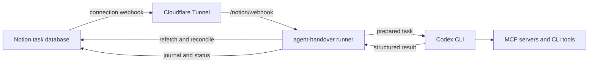

# agent-handover

`agent-handover` is an alpha-stage local service for running explicitly queued
Notion tasks through Codex CLI. It is intended for a trusted operator who wants
a shared task queue and audit journal while keeping execution policy, secrets,
and durable launch state on one private host.

The repository contains the Rust CLI, private host configuration foundation,
webhook-token enrollment, authenticated webhook HTTP intake, authoritative
Notion task refetching, deterministic task-body rendering, reconciliation, and
build and release tooling. `serve` reconciles Pending tasks at startup and at
the configured interval while continuing to accept health checks and webhook
signals. Both discovery sources share one revision-aware workflow that prepares
visible attempts, launches Codex sequentially, and durably stores validated
results. Follow the [roadmap](#roadmap) for the remaining implementation
sequence.

## Intended capabilities

- Discover tasks whose `Status` is `Pending`.
- Use [Notion connection webhooks][notion-webhooks] for prompt discovery and
  reconciliation for reliability.
- Run one task at a time through [Codex's non-interactive interface][codex-exec]
  and the host's existing MCP servers and CLI tools.
- Record every attempt in a shared Notion journal and project task progress as
  `Pending -> Running -> Done | Error`.
- Recover interrupted bookkeeping without automatically launching Codex again.

The private host profile selects Codex as the only executor for the first
release; task authors do not choose an executor in Notion. The internal
executor boundary and shared journal remain provider-neutral, but a Claude
adapter, multiple host profiles, concurrent execution, and automatic agent
retries are out of scope.

Private local state provides the process lock and durable launch authority.
`run-once` performs one reconciliation;
`serve` performs one before HTTP intake begins and repeats it at the configured
interval. Webhook and reconciliation discoveries share a revision-aware,
provider-neutral, sequential execution boundary.

## Architecture



Cloudflare Tunnel only exposes the local webhook endpoint. Tunnel provisioning,
DNS, access controls, and service management belong to the operator, not this
project.

## Quick start

Build and exercise the CLI from the locked development environment:

```sh
nix develop --command cargo run
nix develop --command cargo test
```

Use the built-in guide for the current command descriptions, prerequisites, and
examples:

```sh
agent-handover --help
agent-handover webhook-enroll --help
```

The normal operator sequence is:

1. Configure and share the Notion task and journal data sources, then create
   the private host configuration.
2. Use `run-once` to reconcile and drain current `Pending` tasks without a
   webhook or public tunnel.
3. For continuous operation, enroll the connection webhook token, expose only
   the webhook route through Cloudflare Tunnel, configure the Notion webhook
   subscription, and start `agent-handover serve`.

Before accepting HTTP requests, `serve` completes one authoritative
reconciliation. It then authenticates webhook JSON and repeats reconciliation
at the configured interval without pausing health or webhook intake. Eligible
tasks are made visibly `Running`, executed one at a time, have their validated
result saved in private durable state, and are finalized in the shared journal
before their task status becomes `Done` or `Error`.

## Notion setup

The target runner works with Notion Free through the Public API and connection
webhooks. It does not depend on [paid database automations][notion-automations]
or the paid `Send webhook` automation action. A connection webhook is a change
notification: the runner always refetches current Notion state before deciding
whether a task is eligible.

Create an internal Notion connection, grant only the capabilities needed to
read task content and update task and journal properties, and share both data
sources with that connection.

The task data source must provide:

| Field | Contract |
| --- | --- |
| Title | Existing task title |
| Page body | The complete instruction source for Codex |
| `Status` | Status values `Pending`, `Running`, `Error`, and `Done` |

The shared journal must provide one entry per attempt with:

- an immutable run ID and relation to the task;
- executor and start/end times;
- outcome, summary, actions, and warnings.

Keep data source IDs and property mappings in private host configuration. Do
not put them in this repository.

### Connection webhook

Create the connection and share the task and journal data sources before
enrollment. Then complete the webhook subscription as follows:

1. Choose the tunnel lifecycle described under
   [Cloudflare Tunnel choices](#cloudflare-tunnel-choices). For managed
   credential-file mode, provision the named tunnel and hostname and add its
   `[cloudflared]` profile before enrollment. For remote-token mode or manual
   fallback, omit `[cloudflared]` during enrollment; the callback UUID must be
   printed before the operator can configure its exact route.
2. Run `agent-handover webhook-enroll --hostname handover.example.com`, using
   only the public DNS hostname (without a scheme, port, path, or credentials).
   The command validates the hostname locally without resolving it. A host
   profile is optional, but a valid credential-file profile makes the runner
   generate restricted ingress, start the connector, and wait for an active
   connection before continuing.
3. Keep the command running. It generates a random UUID and prints the exact
   `https://<HOST>/notion/webhook/<UUID>` URL, plus links to
   [Notion Connections][notion-connections] and the [webhook setup
   guide][notion-webhooks]. Nothing is persisted until verification succeeds.
   In remote-token mode, now configure that exact dashboard route and start the
   connector manually. With manual fallback, now configure and start the
   external tunnel. Both must route only the printed callback to
   `http://127.0.0.1:8080` and use a 404 catch-all.
4. In the connection's **Webhooks** tab, create a subscription using that exact
   URL, Notion API version `2026-03-11`, and these event types:

   - `page.created`
   - `page.content_updated`
   - `page.properties_updated`

5. Notion sends one unsigned verification POST to the local enrollment
   listener through the tunnel. The command accepts one bounded request only at
   the exact UUID-bearing path, atomically stores the callback UUID and token,
   prints the token once, and exits.
6. Back in Notion, choose **Verify**, paste the printed token, and activate the
   subscription. The enrollment command then exits and reaps its managed
   credential-file connector. Start `agent-handover serve` only after
   verification. It starts a fresh managed connector when `[cloudflared]` is
   configured; otherwise keep the externally supervised connector running.

Repeat enrollment is refused. To replace an enrollment, delete the verified
Notion subscription (Notion does not allow its URL to be changed), run
`webhook-enroll --hostname <HOST> --rotate`, and create and verify a new
subscription. Credential-file mode generates and supervises the replacement
route automatically. For remote-token mode or manual fallback, omit
`[cloudflared]` during rotation and update the externally managed route to the
new printed path while the command waits. The old UUID and token remain paired
until replacement verification succeeds.

Normal webhook requests are authenticated
from the exact raw body using the `X-Notion-Signature` HMAC. Events are only
signals: they can be delayed, duplicated, or delivered out of order, as
described by [Notion's event-delivery contract][notion-delivery], so the runner
refetches the page and reconciliation remains authoritative for discovery.
Only page-created, page-content-updated, and page-properties-updated signals
whose event parent names the configured task data source are considered. The
runner then retrieves the current page through the Notion API and independently
confirms its parent and `Status = Pending` before forwarding it. The private
host profile supplies the Codex executor; executor-like Notion properties do
not affect eligibility. Page retrieval uses the `2026-03-11` Notion API
contract. Duplicate event
IDs are acknowledged without another refetch; unique events
are not rejected by timestamp because an older delivery can still reveal newer
authoritative state. The runner parses `last_edited_time` as an RFC 3339 instant
and routes webhook and reconciliation discoveries through one coordination
boundary. Decisions for one page are serialized while unrelated pages may be
accepted concurrently. A successfully prepared authoritative revision is the
deduplication key regardless of its discovery source, so an equal or older
revision cannot follow it to preparation. Failed handoffs do not advance the
watermark and can be retried. The bounded cache deterministically evicts the
least recently accepted page and still recognizes a later manual
`Error -> Pending` revision even when the intermediate non-Pending state was
not observed. Runner-owned transitions to `Running`, `Done`, or `Error` are
ignored as feedback signals.

For each eligible revision, the runner retrieves every page of
[block children][notion-blocks] and traverses nested content depth-first in
stable Notion source order. The resulting deterministic Markdown is the sole
task instruction document sent to the orchestration boundary and is never
included in normal logs or errors.
Paragraphs, headings, lists, tasks, toggles, quotes, callouts, code, equations,
dividers, tables, columns, tabs, templates, and synced blocks have explicit
rendering or structural behavior. Tabs are transparent containers whose
ordinary children remain in source order. Table rows use deterministic
structural list items so they remain valid Markdown without inventing a header
row. Rich-text annotations and ordinary HTTP(S) links are preserved; mentions
are rendered as inert labels without following targets.

Child pages, child databases, linked pages, bookmarks, embeds, link previews,
files, images, video, audio, and PDFs are represented by safe labels and are
never fetched automatically. Unknown and Notion `unsupported` blocks produce a
deterministic unsupported-block label. Meeting notes, breadcrumbs, and tables
of contents are also represented without following generated references.
Traversal is serial within a task and is bounded to 32 nested levels, 10,000
blocks, 10,000 paginated responses, 16 MiB of source responses, and 1 MiB of
rendered Markdown. Each response is independently limited to 1 MiB and five
seconds; cursor and child cycles are rejected with content-free diagnostics.

Webhook request bodies are limited to 1 MiB and must arrive within five
seconds. Oversized requests receive `413 Payload Too Large`; slow request bodies
receive `408 Request Timeout` without blocking health checks or other requests.
The server admits at most 16 active connections. Excess connections are closed,
each admitted connection has a ten-second whole-lifecycle deadline, and shutdown
closes outstanding connections so partial requests cannot delay termination.
Authenticated discovery is independently limited to 16 active event
supervisors. Duplicate deliveries subscribe to their existing supervisor
without consuming another slot, while excess unique events wait without
claiming event or page state.

#### Cloudflare Tunnel choices

Notion requires a public HTTPS webhook URL and cannot reach localhost. The
operator owns the Cloudflare account resources: install
[`cloudflared`][cloudflare-install], create the named tunnel and public
hostname, and obtain only the credential needed by the runner host. Creating a
tunnel, changing DNS, assigning public hostnames, and changing dashboard
ingress are never actions `agent-handover` takes.

The optional `[cloudflared]` host-profile table instead asks the runner to
supervise an already-provisioned connector while `webhook-enroll` and `serve`
run. Choose one of these delivery modes:

- **Credential-file mode** uses a tunnel-specific JSON credential. The runner
  writes a private local ingress configuration with exactly the enrolled
  callback and a 404 catch-all, then starts and stops `cloudflared` as its
  child. This is the managed flow for enrollment and rotation.
- **Remote-token mode** uses a dashboard-managed tunnel token. The operator
  configures the dashboard ingress; before starting, the runner reads it using
  a separately supplied account API token and rejects anything other than the
  exact callback route and 404 catch-all. The runner never writes local ingress
  in this mode. Because a callback ID is generated during enrollment, initial
  enrollment and every rotation use the manual flow below; add the remote-token
  profile only after the dashboard route matches the stored callback.
- **Manual fallback** omits `[cloudflared]`. The operator starts and supervises
  any tunnel implementation and keeps its routing configuration outside this
  project. This remains supported for all lifecycle operations.

For a locally managed credential-file tunnel, Cloudflare's
[named-tunnel guide][cloudflare-named-tunnel] explains installation and
creation. Move only the resulting tunnel JSON credential (not the account-wide
`cert.pem`) directly into the private `agent-handover` configuration directory,
with mode `0600`; Cloudflare explains the different scopes in its
[tunnel-permissions guide][cloudflare-tunnel-permissions]. The runner requires
that placement and permission, generates its own mode-`0600` configuration
under its private state directory, and does not expose either file in logs.

For reference, the runner-generated credential-file ingress has this shape. It
is not an operator-maintained file and all values shown are placeholders:

```yaml
tunnel: <TUNNEL_UUID>
credentials-file: /path/to/<TUNNEL_UUID>.json

ingress:
  - hostname: handover.example.com
    path: ^/notion/webhook/<CALLBACK_UUID>$
    service: http://127.0.0.1:<PORT>
  - service: http_status:404
```

The `path` value is an anchored regular expression so it matches only the
generated endpoint. The `<PORT>` must match the listener (currently `8080`).
The final catch-all rule prevents the tunnel from exposing other local routes.
For remote-token mode, configure that same two-rule ingress in the Cloudflare
dashboard before adding the profile; the [remote-tunnel][cloudflare-remote-tunnel]
and [tunnel-token][cloudflare-tunnel-tokens] guides describe those resources.
Use a token that can run only that connector and a separate, least-privilege API
token able to read its configuration. The remote token and API token both stay
in the mode-`0600` host profile; the runner copies the connector token to a
private mode-`0600` state file and passes it to `cloudflared` without putting it
in command arguments or the child environment.

With manual fallback, preserve the exact public path and forward the unmodified
body and `X-Notion-Signature` header. Do not use a quick tunnel or a catch-all
route that also exposes the runner's health endpoint.

## Private host configuration

The CLI reads one host-wide TOML profile from
`$XDG_CONFIG_HOME/agent-handover/config.toml`, falling back to
`$HOME/.config/agent-handover/config.toml`. Durable state belongs under
`$XDG_STATE_HOME/agent-handover`, falling back to
`$HOME/.local/state/agent-handover`.

The application directories are created or corrected to mode `0700`. The
configuration file must already exist with mode `0600`; the runner refuses to
read a more permissive file. Create a private file containing placeholder-free
host values in this form:

```toml
[notion]
# Optional when `ntn auth token --plain` can resolve a saved credential.
token = "<NOTION_CONNECTION_TOKEN>"
task_data_source_id = "<TASK_DATA_SOURCE_ID>"
journal_data_source_id = "<JOURNAL_DATA_SOURCE_ID>"

[task_properties]
title = "Name"
status = "Status"

[task_values]
pending = "Pending"
running = "Running"
error = "Error"
done = "Done"

[journal_properties]
run_id = "Run ID"
task = "Task"
executor = "Executor"
started_at = "Started at"
ended_at = "Ended at"
outcome = "Outcome"
summary = "Summary"
actions = "Actions"
warnings = "Warnings"

[journal_values]
executor = "Codex"

[codex]
executable = "codex"
working_directory = "/absolute/path/to/project"
profile = "runner"
sandbox = "workspace-write"
permitted_environment = ["PATH"]
timeout_seconds = 900

[runner]
reconciliation_interval_seconds = 60
bind_address = "127.0.0.1:8080"
webhook_path = "/notion/webhook"
health_path = "/health"

# Optional managed Cloudflare Tunnel profile. The tunnel and hostname already
# exist in Cloudflare; agent-handover neither creates nor changes them.
[cloudflared]
executable = "cloudflared"
hostname = "handover.example.com"
tunnel_id = "<EXISTING_TUNNEL_UUID>"
credentials_file = "/absolute/XDG_CONFIG_HOME/agent-handover/<EXISTING_TUNNEL_UUID>.json"
```

For a remotely managed token tunnel, replace `credentials_file` with all three
private values below. First enroll manually and configure the dashboard's exact
callback route; then add this profile. The runner reads and verifies that
remote configuration before it starts `cloudflared`, but never writes it.

```toml
token = "<EXISTING_TUNNEL_TOKEN>"
account_id = "<CLOUDFLARE_ACCOUNT_ID>"
api_token = "<READ_TUNNEL_CONFIGURATION_API_TOKEN>"
```

Remote-token mode uses `cloudflared` 2025.4.0 or later and its supported
`--token-file` interface. The token is copied to a private state file so it
never appears in process arguments or the connector environment; no local
ingress configuration is generated for token tunnels.

Supported sandbox values are `read-only`, `workspace-write`, and
`danger-full-access`; the runner passes the configured policy through without
weakening it. The required `[codex]` table is the private executor selection for
this one-executor host profile. The bind address must include a port and use an
IPv4 or IPv6 loopback address. `runner.webhook_path` must remain
`/notion/webhook`, matching enrollment; `serve` appends the privately enrolled
callback UUID and accepts webhook work only at that exact resulting path.
Property names and lifecycle values must be
non-empty and distinct, the Codex working directory must be absolute, durations
must be positive, and the environment list accepts variable names only—not
values.

An explicit `notion.token` is always preferred. If it is omitted, the runner
invokes `ntn auth token --plain` noninteractively using the runner process's
user environment so `ntn` can discover its saved keyring or file credential.
The resolved token is held only in memory and is never logged or persisted by
the runner. An `ntn login` credential is user- and workspace-scoped and may
grant broader access than a least-privilege internal connection. Prefer an
explicit connection token when that narrower security boundary matters.

Operational state, verification tokens, prompts, agent output, run records, and
host-specific paths must never be committed. Configuration diagnostics and
normal logs omit the Notion token and data source IDs.

The callback UUID and webhook verification token are stored together at
`$XDG_STATE_HOME/agent-handover/notion-webhook-enrollment.json`, falling back to
`$HOME/.local/state/agent-handover`. The file is created atomically with mode
`0600`; symbolic links and unsafe existing files are refused. Rotation replaces
the pair in one rename, so the values cannot come from different enrollments.

The optional `[cloudflared]` profile selects an already provisioned named
tunnel. Its hostname is validated locally. Credential-file mode requires a
mode-`0600` credential file directly in the private XDG configuration directory
and lets the runner generate restricted local ingress. Remote-token mode
requires `token`, `account_id`, and `api_token` in the mode-`0600` host profile
and leaves ingress in Cloudflare. In either mode, the runner waits for an
active HA connection before accepting HTTP intake, terminates and reaps the
connector process group when serving ends, and stops serving if the connector
exits unexpectedly. Credential-file mode also starts a connector and waits for
it before printing Notion steps during enrollment; remote-token enrollment and
rotation use the manual flow because their exact callback route must be
configured first.
In credential-file mode, the generated configuration routes only the enrolled
callback UUID to the configured loopback origin and ends in an HTTP 404
catch-all. The runner never creates or changes Cloudflare account resources.
Remote-token profiles verify the same ingress with Cloudflare before serving
and use the private token file, not a local ingress configuration.

## Commands

The CLI supports `--help` / `-h` for an in-terminal setup guide and `--version`
/ `-V` for its installed version:

```console
$ agent-handover
agent-handover runs queued Notion tasks through Codex on this host.

$ agent-handover --version
agent-handover 0.1.0
```

The runner interface is:

| Command | Target behavior |
| --- | --- |
| `agent-handover serve` | Reconcile Pending tasks at startup, then serve health and authenticated webhook routes while repeating reconciliation at the configured interval; all eligible discoveries execute sequentially |
| `agent-handover run-once` | Query and authoritatively validate current Pending tasks once, execute them sequentially, and wait for the complete drain |
| `agent-handover webhook-enroll --hostname <HOST>` | Generate and display the exact secret callback URL, then receive one verification POST on loopback |
| `agent-handover webhook-enroll --hostname <HOST> --rotate` | Atomically replace an existing callback UUID and verification token |

Unsupported or incomplete configuration will fail with actionable errors that
do not reveal secrets.

`run-once` requires the private host configuration but does not need an
enrolled webhook token or public tunnel. `serve` requires the same configuration
and a complete enrollment containing both the callback UUID and token; public
Notion delivery additionally requires the HTTPS
tunnel and webhook subscription described above. Both commands only run tasks
whose current `Status` is `Pending`, and send the recursively rendered task
page body to Codex as its instruction source.

Enrollment prints the exact public callback URL to register in Notion, then
waits for the one-time verification POST routed to local port 8080:

```sh
agent-handover webhook-enroll --hostname handover.example.com
```

Repeat enrollment is refused. Use `--rotate` only when deliberately replacing
the enrolled callback UUID and token:

```sh
agent-handover webhook-enroll --hostname handover.example.com --rotate
```

## Task lifecycle and safety

An eligible task follows this lifecycle:

1. Discovery confirms `Status = Pending` from current Notion state; the private
   host profile supplies Codex as the executor.
2. The runner creates a durable local attempt with a new run ID.
3. It changes the task to `Running`, creates the journal attempt, and verifies
   both are visible before execution.
4. It persists `launch_intent` immediately before starting Codex once.
5. It validates and durably saves Codex's structured result, finalizes the
   journal, verifies the terminal fields, and then projects `Done` or `Error`.

One process lock protects each stable local state directory, and one task runs
at a time. Local run records are the authority for automatic launch decisions;
Notion status is an observable projection, not a distributed lock.

`run-once` queries the configured task data source once, following bounded
pagination, after first resuming any locally prepared attempt that has not
crossed its launch boundary. It then refetches every candidate before accepting
it. Candidates
whose source, current Pending status, trash state, or observed revision no
longer matches are ignored. The accepted set is ordered by authoritative
`last_edited_time`, with page ID as a stable tie-breaker, and executed through
the shared provider-neutral revision coordinator one task at a time. The
command returns only after the complete cycle or a content-free actionable
error.

`serve` performs the same pre-launch recovery and authoritative reconciliation
before its HTTP accept loop is considered started. It then repeats the cycle every
`runner.reconciliation_interval_seconds` while health checks and authenticated
webhook signals remain active. Scheduled and webhook discoveries share one
revision coordinator and one sequential preparation boundary, so the same or
an older revision is not prepared twice across sources. A failed periodic
cycle emits a content-free diagnostic and the next configured cycle still
runs. Clean shutdown stops HTTP intake and waits for an active reconciliation
and preparation handoff to finish; it does not abandon that work midway.

Each local attempt is durably published with mode `0600` before orchestration
performs remote writes. The workflow updates and reads back `Running`, creates
the initial journal record, and queries its immutable run ID. An ambiguous
creation response is resolved by that query without a second create, and Codex
is not launched until both remote records match. The runner then persists
`launch_intent`, invokes Codex with only the rendered task body, validates its
structured result, and stores that result durably before returning. Discovery
never relaunches an attempt whose launch boundary was crossed. Records exclude
task instructions, secrets, and host paths. The non-blocking process lock
rejects a second owner for the same state directory and is released when its
owner exits.

At startup, result-stored attempts are finalized first without invoking Codex.
Journal finalization precedes terminal task status, and both writes are read
back before the local attempt is marked finalized. Repeating startup or
`run-once` safely replays incomplete terminal writes by immutable run ID.

At startup, a locally prepared attempt remains launch authority even if the
previous process already made its Notion task and journal visibly `Running`.
The runner refetches and renders that task, queries the journal by the original
run ID before attempting creation, and crosses the launch boundary for that
same run ID at most once. Ambiguous duplicate prepared records fail safely.

### Recovery and retries

Startup recovery may replay safe Notion reads and idempotent journal or status
finalization. It never automatically repeats an agent action or relaunches an
attempt whose launch boundary was crossed. Such an attempt becomes `Error` with
an `outcome unknown; external effects may have occurred` warning.

To retry, an operator changes `Error` back to `Pending`. That creates a distinct
attempt and run ID. External actions may not be idempotent, so a manual retry can
duplicate effects.

> [!WARNING]
> `agent-handover` targets at-most-once automatic launch, not exactly-once
> execution. A crash at the launch boundary can mean Codex ran while the runner
> cannot prove the outcome; recovery favors avoiding a duplicate launch.

## Security model

- Treat anyone who can edit an eligible Notion task body as able to instruct
  Codex with the configured host permissions.
- Bind the HTTP server to loopback by default and expose only the intended
  webhook route through a separately managed tunnel.
- Verify webhook signatures before parsing or queuing events, then refetch
  current Notion state.
- Run Codex with the configured least-privilege sandbox. Never enable sandbox
  bypass implicitly.
- Allow only an explicit environment set, and keep credentials out of logs,
  fixtures, command output, and version control.
- The runner does not automatically follow relations, linked pages, or
  attachments. A task may direct Codex to access them through configured tools.

## Troubleshooting

- **Managed connector does not start:** verify the configured executable can
  run, the named tunnel and hostname already exist, and credentials are in the
  required private location. In remote-token mode, also verify the dashboard
  ingress is exactly the enrolled hostname, callback path, loopback origin, and
  404 fallback. Correct Cloudflare resources outside the runner, then rerun
  `serve`; it performs startup reconciliation before accepting webhooks.
- **Managed connector exits unexpectedly:** `serve` stops HTTP intake and
  exits rather than continuing without its expected public route. Restore the
  connector or use the manual fallback, then restart `serve`. The restart
  performs safe local and Notion recovery but never automatically reruns an
  agent action that crossed its launch boundary.
- **Stopping or rotating a tunnel:** `SIGINT` and `SIGTERM` stop intake, drain
  active safe preparation, and reap a runner-managed connector. For a
  credential-file profile, run `webhook-enroll --rotate`; it writes the new
  restricted local ingress while the command waits for Notion. For a
  remote-token profile, temporarily use manual fallback: remove the profile,
  run `webhook-enroll --rotate`, update the dashboard's exact callback ingress
  while it waits, verify the new subscription, then restore the profile. Delete
  the old Notion subscription because its verified URL cannot change.
- **No webhook arrives:** confirm the subscription is active, the public HTTPS
  route is reachable, and the connection can access the changed page. Some
  Notion events are aggregated and delayed.
- **A webhook changes nothing:** confirm the current page still has
  `Status = Pending`; stale and unrelated events are intentionally ignored.
- **A task missed its webhook:** wait for the next periodic reconciliation in
  `serve`, restart `serve` to run startup reconciliation, or use `run-once`.
- **A task is `Error` after restart:** inspect its journal warning before
  choosing a manual retry; external effects may already have occurred.
- **The runner refuses to start:** check private file permissions, the stable
  state-directory lock, property mappings, and required Codex configuration.

## Development

All dependencies come from the locked Nix flake. Install Nix with flakes enabled
and optionally direnv with nix-direnv support, then enter the environment:

```sh
direnv allow
```

Without direnv, prefix development commands with `nix develop --command`:

```sh
nix develop --command cargo test
nix develop --command cargo fmt --check
nix develop --command cargo clippy --all-targets -- -D warnings
```

The main verification command matches CI:

```sh
nix flake check
```

GitHub Actions runs these checks on Linux x86-64. CI evaluates the complete
flake, then runs the GNU and quality checks alongside the musl build on
separate runners. Crane build artifacts let the GNU package, Clippy, and tests
reuse the same compiled Rust dependencies within their job.

Build either Linux x86-64 release target with:

```sh
nix build .#gnu
nix build .#musl
```

`gnu` produces a glibc-linked binary. `musl` produces a statically linked
binary. Both supported release variants are built by `nix flake check`; the
project does not publish or validate additional operating-system targets.

## Releases

The release workflow is scheduled for every Monday at 15:00 UTC and can also
be started on demand with GitHub Actions' **Run workflow** control.
Qualifying Conventional Commits since the latest release determine the next
version: `feat` creates a minor release; `fix`, `perf`, `refactor`, and
`revert` create a patch release; and breaking changes create a major release.
Generated changelog entries,
release tags, and version metadata are maintained by the release workflow.

## Roadmap

1. Private configuration, command structure, and Notion schema validation.
2. Notion client, webhook enrollment, authentication, and content retrieval.
3. Durable local attempts, locking, reconciliation, and preparation.
4. Codex execution with validated structured results.
5. Journal finalization and crash-safe recovery.
6. Later: additional executor adapters, multiple profiles, concurrency, and
   stronger isolation.

## License

Licensed under the [MIT License](LICENSE).

[cloudflare-install]: https://developers.cloudflare.com/tunnel/advanced/local-management/create-local-tunnel/#1-download-and-install-cloudflared
[cloudflare-named-tunnel]: https://developers.cloudflare.com/tunnel/advanced/local-management/create-local-tunnel/
[cloudflare-remote-tunnel]: https://developers.cloudflare.com/tunnel/advanced/remote-management/
[cloudflare-tunnel-permissions]: https://developers.cloudflare.com/tunnel/features/locally-managed-tunnels/tunnel-permissions/
[cloudflare-tunnel-tokens]: https://developers.cloudflare.com/tunnel/advanced/tunnel-tokens/
[codex-exec]: https://developers.openai.com/codex/noninteractive
[notion-automations]: https://www.notion.com/help/database-automations
[notion-delivery]: https://developers.notion.com/reference/webhooks-events-delivery
[notion-connections]: https://app.notion.com/developers/connections
[notion-webhooks]: https://developers.notion.com/reference/webhooks
[notion-blocks]: https://developers.notion.com/reference/block
